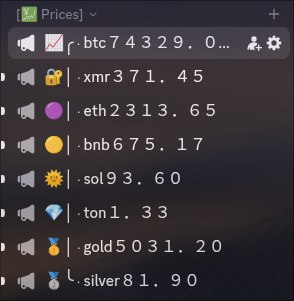
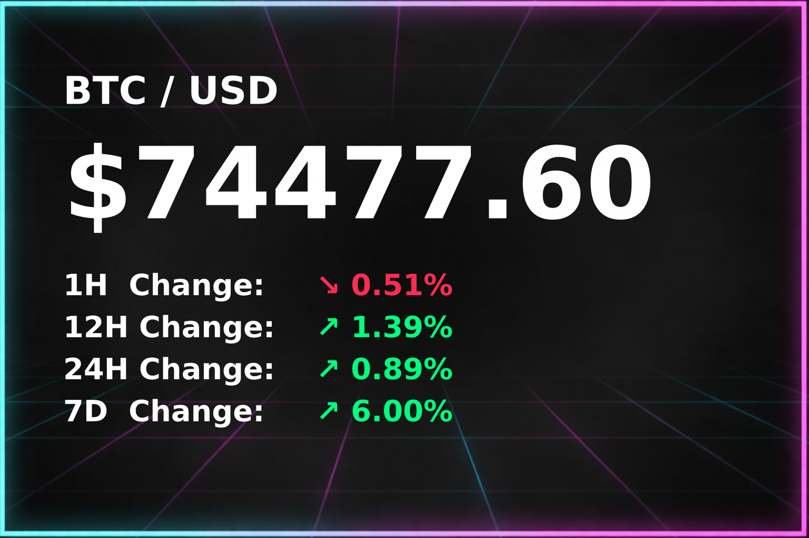

# Discord Pricebot
Track crypto and precious metal prices in Discord.



Each asset gets a dedicated channel — the bot updates the channel name with the live price every 5 minutes and renders and sends a price card to the channel.



## What it tracks
- **Crypto** via CoinPaprika: BTC, ETH, SOL, BNB, TON, XMR — add your own easily
- **Metals** via gold-api.com: Gold, Silver

### How metal change % works
Since gold-api.com doesn't provide historical change data, the bot maintains its own `price_history.json`, sampling prices every 5 minutes and calculating 1H/12H/24H/7D changes internally. Json history is pruned on a rolling 30-day window. When running a fresh install, it will take time for the price history to build up before it incrementally adds the hourly changes to the printed price cards.

## Setup
1. Make a channel for each asset you want to track
2. For each channel, create a Channel Webhook (in Discord channel settings)
3. Add each Channel ID and Webhook to `.env`
4. Build the binary: `cargo build --release`
5. (Optional) Add a systemd service
```env
DISCORD_BOT_TOKEN=

BTC_CHANNEL_ID=      
BTC_WEBHOOK=
ETH_CHANNEL_ID=      
ETH_WEBHOOK=
SOL_CHANNEL_ID=      
SOL_WEBHOOK=
BNB_CHANNEL_ID=      
BNB_WEBHOOK=
TON_CHANNEL_ID=      
TON_WEBHOOK=
XMR_CHANNEL_ID=      
XMR_WEBHOOK=
GOLD_CHANNEL_ID=     
GOLD_WEBHOOK=
SILVER_CHANNEL_ID=   
SILVER_WEBHOOK=
```

Requires `background.png` in the working directory and DejaVu fonts on the host.
